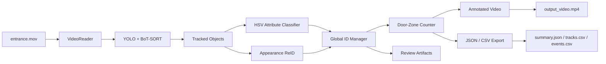

# Smart Entrance People Analytics

ระบบนับคนจากวิดีโอทางเข้า/ออกอาคาร โดยใช้ YOLO, Multi-Object Tracking, Appearance-based ReID, Door-Zone Counting และ Attribute Classification

โปรเจกต์นี้ออกแบบสำหรับโจทย์ People Counting จากวิดีโอ โดยเป้าหมายหลักคือ “นับจำนวนคนแบบไม่ซ้ำ” ไม่ใช่แค่นับจำนวน bounding box ในแต่ละเฟรม

## Objective

โจทย์ต้องการนับจำนวนคนที่เดินผ่านบริเวณทางเข้า/ออกจากวิดีโอ และส่งผลลัพธ์พร้อม source code, README, requirements และวิดีโอผลลัพธ์

ระบบนี้ออกแบบให้ตอบโจทย์หลัก:

- ตรวจจับคนในวิดีโอ
- ติดตามคนข้ามเฟรม
- ลดการนับซ้ำเมื่อ tracker เปลี่ยน ID
- นับ enter / exit จาก zone บริเวณประตู
- แยกกลุ่ม SuperAI / Non-SuperAI / Unknown
- สร้าง annotated video และ export ผลลัพธ์เป็นไฟล์

## Why Not Count Bounding Boxes?

การนับ bounding box ต่อเฟรมไม่ใช่คำตอบของโจทย์นี้ เพราะคนหนึ่งคนจะปรากฏอยู่หลายเฟรม

ตัวอย่าง:

```txt
1 person appears for 120 frames
ถ้านับทุก detection = 120 counts
แต่ความจริง = 1 person
```

ดังนั้นระบบนี้ใช้ pipeline ที่มี tracking, Global ID และ zone counting เพื่อให้การนับใกล้เคียงการใช้งานจริงมากขึ้น

## System Overview

```txt
Video Input
   |
   v
YOLO Person Tracking
   |
   v
Track ID
   |
   v
Appearance ReID
   |
   v
Global ID
   |
   v
Door-Zone Counting
   |
   v
Attribute Classification
   |
   v
Visualization + Export
```

## Architecture Diagram



## Key Ideas

### 1. Detection and Tracking

ระบบใช้ YOLO ผ่าน Ultralytics สำหรับตรวจจับ class `person` และใช้ BoT-SORT สำหรับติดตามคนข้ามเฟรม

ผลลัพธ์จาก tracker:

- bounding box
- confidence
- track ID
- trajectory
- timestamp

ในวิดีโอ:

```txt
T = Tracker ID
```

Tracker ID มีประโยชน์ แต่ยังไม่พอสำหรับการนับคนแบบไม่ซ้ำ เพราะ ID อาจเปลี่ยนเมื่อคนถูกบังหรือออกจากเฟรม

### 2. Global ID and ReID

ระบบสร้าง `Global ID` เพื่อใช้เป็น anonymous person identity

ในวิดีโอ:

```txt
G = Global ID
T = Tracker ID
```

ตัวอย่าง:

```txt
G12 T31
```

หมายความว่า tracker ตอนนี้ให้ ID เป็น `T31` แต่ระบบมองว่าเป็นคนที่มี Global ID `G12`

ReID ใช้ appearance feature แบบ lightweight เช่น:

- สีเสื้อ
- สีกางเกง
- สีรองเท้า
- บริเวณศีรษะ/ผมแบบหยาบ
- full-body color moments
- shape ของ bounding box
- temporal gap
- spatial distance

ระบบนี้ไม่ใช้ automatic face recognition และไม่ใช้ biometric identity

### 3. Door-Zone Counting

ระบบไม่ได้นับทันทีที่ detect เจอคน แต่จะนับจาก movement ผ่าน zone

ใช้ 3 zone:

```txt
inside <-> door <-> outside
```

Counting logic:

```txt
outside -> door -> inside = enter
inside -> door -> outside = exit
outside -> door -> lost = enter
inside -> door -> lost = exit
door -> inside = enter
door -> outside = exit
```

เหตุผลที่ใช้ zone เพราะในวิดีโอจริง คนบางคนเดินเข้าประตูแล้วหายจากกล้องก่อนจะเห็นการข้ามเส้นชัดเจน การใช้ door zone จึงเหมาะกับสถานการณ์จริงมากกว่า line crossing อย่างเดียว

### 4. Attribute Classification

ระบบแยกประเภทคนจากสีเสื้อด้วย HSV rule-based classifier

กลุ่มที่รองรับ:

- `superai_shirt`: มีหลักฐานสีน้ำเงิน/ฟ้าชัดเจน
- `non_superai`: มั่นใจว่าไม่ใช่เสื้อ SuperAI
- `unknown`: ยังไม่มั่นใจ เช่น โดนบัง แสงไม่ดี หรือเห็นเสื้อไม่ครบ

ระบบไม่ตัดสินจากเฟรมเดียว แต่ใช้ vote ต่อ Global ID

```txt
frame-level prediction
-> category vote per Global ID
-> final category per person
```

`unknown` ถูกใช้เป็น safe class ถ้าหลักฐานไม่พอ ระบบจะไม่เดาสุ่ม

## Code Architecture

โค้ดถูกจัดเป็น layer เพื่อให้อ่านง่ายและต่อยอดได้เหมือนโปรเจกต์จริง

```txt
main.py
  -> config/settings.py
  -> app/runner.py
  -> app/factories.py
  -> vision/
  -> counter.py
  -> visualization/
  -> io/
  -> observability/
```

### Folder Responsibility

```txt
src/
├── app/
│   ├── runner.py
│   ├── factories.py
│   └── summaries.py
├── config/
│   └── settings.py
├── domain/
│   └── __init__.py
├── io/
│   ├── artifacts.py
│   └── video.py
├── observability/
│   └── logging.py
├── vision/
│   ├── attributes.py
│   ├── identity.py
│   ├── reid.py
│   └── tracking.py
├── visualization/
│   └── renderer.py
├── counter.py
├── global_id_manager.py
├── tracker.py
├── reid.py
├── attribute_classifier.py
├── exporter.py
├── metrics.py
├── preview.py
├── video_reader.py
└── utils.py
```

หน้าที่หลัก:

- `main.py`: entrypoint
- `app/runner.py`: คุม realtime pipeline
- `app/factories.py`: สร้าง components จาก config
- `app/summaries.py`: สร้าง live/final summary
- `vision/`: tracking, ReID, attribute classification
- `counter.py`: enter/exit counting logic
- `visualization/`: วาด annotated video
- `io/`: video reader/writer และ exporters
- `observability/`: logging และ runtime report

## Runtime Flow

```txt
1. Load config
2. Open video
3. Track people with YOLO + BoT-SORT
4. Extract appearance feature
5. Classify shirt attribute
6. Assign Global ID
7. Update zone counter
8. Render annotated frame
9. Save output video
10. Export summary, tracks, events, performance
```

## Output Files

```txt
outputs/output_video.mp4
outputs/summary.json
outputs/tracks.csv
outputs/events.csv
outputs/performance_report.json
outputs/head_contact_sheet.jpg
outputs/head_crops/
outputs/review_crops/
outputs/logs/run.log
```

### Annotated Video

```txt
outputs/output_video.mp4
```

วิดีโอแสดง:

- bounding box
- Global ID / Track ID
- category
- trajectory
- zone
- unique count
- enter / exit count
- SuperAI / Non-SuperAI / Unknown count

### Summary JSON

```txt
outputs/summary.json
```

สรุปผลลัพธ์รวม เช่น:

```json
{
  "total_unique_people": 72,
  "enter_count": 18,
  "exit_count": 51,
  "superai_people": 60,
  "non_superai_people": 11,
  "unknown_people": 1
}
```

### Tracks CSV

```txt
outputs/tracks.csv
```

เก็บข้อมูลราย Global ID เช่น:

- global ID
- track IDs ที่ถูก stitch รวม
- category
- first seen / last seen
- confidence

### Events CSV

```txt
outputs/events.csv
```

เก็บ event เข้า/ออก เช่น:

- event id
- global id
- enter / exit
- timestamp
- frame id
- category

### Performance Report

```txt
outputs/performance_report.json
```

เก็บ runtime metrics เช่น:

- average FPS
- average latency
- p95 latency
- tracking time
- ReID + attribute time
- counting time
- visualization time

## Review Artifacts

ระบบ export ภาพสำหรับ manual review เพื่อให้ตรวจสอบผลได้มากกว่าการดูวิดีโออย่างเดียว

### Head Crops

```txt
outputs/head_crops/
outputs/head_contact_sheet.jpg
```

ใช้ตรวจสอบว่า Global ID เดียวกันยังดูเป็นคนเดิมหรือไม่

ส่วนนี้ไม่ใช่ face recognition และไม่ได้ใช้ใบหน้าเป็น biometric matching เป็นเพียง artifact สำหรับ manual audit

### Review Crops

```txt
outputs/review_crops/
outputs/review_crops/non_superai_contact_sheet.jpg
outputs/review_crops/unknown_contact_sheet.jpg
```

ใช้ตรวจกลุ่มที่ควรดูเพิ่ม เช่น:

- `non_superai`
- `unknown`

เหตุผลคือบางคนอาจไม่ได้ใส่เสื้อ SuperAI แต่มีป้ายหรือสายคล้องคอ หรือบางเฟรมอาจถูกบังจน classifier ไม่มั่นใจ

## Configuration

ค่าหลักอยู่ใน `config.yaml`

ตัวอย่าง:

```yaml
video:
  input_path: "entrance.mov"
  output_path: "outputs/output_video.mp4"
  resize_width: 1280
  process_every_n_frames: 1

detection:
  model_name: "yolov8n.pt"
  confidence_threshold: 0.35
  iou_threshold: 0.5

tracking:
  tracker_type: "botsort"
  min_track_length: 5

reid:
  enabled: true
  appearance_threshold: 0.752
  max_time_gap_seconds: 35.0
  max_spatial_distance: 650

counting:
  mode: "zone"
  disappear_after_frames: 8

attribute:
  blue_ratio_threshold: 0.24
```

## Installation

```bash
python -m venv .venv
source .venv/Scripts/activate
python -m pip install -r requirements.txt
```

## How to Run

วางไฟล์วิดีโอไว้ที่ root project:

```txt
entrance.mov
```

รัน:

```bash
python main.py
```

หรือระบุ config:

```bash
python main.py --config config.yaml
```

ผลลัพธ์จะถูกสร้างใน `outputs/`

## Example Result

ผลลัพธ์จากการรันกับวิดีโอตัวอย่าง:

```txt
Total Unique People: 72
Enter Count: 18
Exit Count: 51
SuperAI People: 60
Non-SuperAI People: 11
Unknown: 1
```

หมายเหตุ: ตัวเลขนี้เป็นผลจาก automated pipeline ไม่ใช่ manual ground truth หากต้องการวัด accuracy อย่างเป็นทางการ ควรสร้าง ground truth แล้วเทียบผลเพิ่ม

## Limitations

- ReID แบบ color/appearance ยังไม่แม่นเท่า OSNet หรือ FastReID
- ถ้าคนแต่งตัวคล้ายกันมาก ระบบอาจ merge ผิด
- ถ้าคนถูกบังหนัก ระบบอาจแยกคนเดิมเป็นหลาย Global ID
- HSV classifier อ่อนไหวต่อแสงและ motion blur
- Zone polygon ต้อง calibrate ให้ตรงกับมุมกล้อง
- FPS บน CPU อาจยังไม่ realtime เต็ม 30 FPS

## Future Improvements

- ใช้ deep ReID model เช่น OSNet หรือ FastReID
- train classifier สำหรับเสื้อ SuperAI โดยเฉพาะ
- เพิ่ม manual ground-truth evaluation
- เพิ่ม dashboard สำหรับ live camera
- เพิ่ม heatmap และ timeline analytics
- optimize inference ด้วย ONNX Runtime / TensorRT / OpenVINO

## Short Idea Description

ระบบนี้ใช้ YOLO ตรวจจับและ track คน จากนั้นสร้าง Global ID ด้วย appearance-based ReID เพื่อลดการนับซ้ำ แล้วนับ event เข้า/ออกจาก door zone แทนการนับ bounding box ต่อเฟรม พร้อมแยกประเภทเสื้อ SuperAI / Non-SuperAI / Unknown และ export วิดีโอ, JSON, CSV, performance report และ review artifacts สำหรับตรวจสอบย้อนหลัง