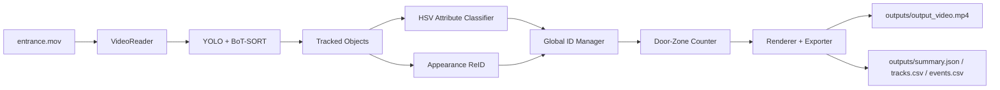

# Smart Entrance People Analytics

ระบบนับคนจากวิดีโอทางเข้า/ออกอาคารโดยใช้ YOLO, BoT-SORT, appearance-based ReID, zone counting และ HSV attribute classification

โปรเจกต์นี้ออกแบบสำหรับโจทย์ People Counting จากวิดีโอ โดยเป้าหมายคือการนับคนแบบไม่ซ้ำ ไม่ใช่การนับ bounding box รายเฟรม

## Objective

ระบบนี้รองรับ pipeline แบบ realtime single pass สำหรับ:

- ตรวจจับคนด้วย YOLO
- ติดตามคนข้ามเฟรมด้วย BoT-SORT
- ลดการนับซ้ำเมื่อ tracker เปลี่ยน ID
- สร้าง Global ID จาก appearance-based ReID
- นับ enter / exit จาก door-zone logic
- แยก SuperAI / Non-SuperAI / Unknown
- export annotated video, CSV, JSON, performance report และ review artifacts

## System Overview



## Key Ideas

### Detection and Tracking

ระบบใช้ Ultralytics YOLO สำหรับตรวจจับ class `person` และใช้ BoT-SORT สำหรับติดตามคนข้ามเฟรม

ผลจาก tracker ประกอบด้วย:

- bounding box
- confidence
- track ID
- trajectory
- timestamp

Tracker ID มีประโยชน์ แต่ยังไม่พอสำหรับการนับคนแบบไม่ซ้ำ เพราะ ID อาจเปลี่ยนเมื่อคนถูกบัง ออกจากเฟรม หรือกลับเข้ามาใหม่

### Global ID and ReID

ระบบสร้าง Global ID เพื่อใช้เป็น anonymous person identity

ReID ใช้ multi-region appearance feature แบบ lightweight เพื่อช่วย stitch track ที่แตก fragment:

- เสื้อ
- กางเกง
- รองเท้า
- ศีรษะ/ผมแบบหยาบ
- full-body color moments
- shape descriptor ของกรอบคน
- temporal gap
- spatial distance

ระบบนี้ไม่ใช้ face recognition และไม่ใช้ biometric identity

### Door-Zone Counting

ระบบไม่ได้ count ทันทีเมื่อ detect เจอคน แต่จะนับจากการเคลื่อนผ่าน zone บริเวณประตู

ใช้ 3 zone หลัก:

```txt
inside <-> door <-> outside
```

Logic หลัก:

```txt
outside -> door -> inside = enter
inside -> door -> outside = exit
outside -> door -> lost = enter
inside -> door -> lost = exit
door -> inside = enter
door -> outside = exit
```

### Attribute Classification

ระบบแยกประเภทคนจากสีเสื้อด้วย HSV rule-based classifier

กลุ่มที่รองรับ:

- `superai_shirt`: มีหลักฐานสีน้ำเงิน/ฟ้าชัดเจน
- `non_superai`: มั่นใจว่าไม่ใช่เสื้อ SuperAI
- `unknown`: หลักฐานไม่พอหรือภาพไม่ชัด

ผลระดับเฟรมจะถูก vote ต่อ Global ID เพื่อสร้าง final category

## Code Architecture

โครงสร้างโค้ดแยกเป็น layer แบบ production-style

```txt
main.py
  -> config/settings.py
  -> app/runner.py
  -> app/factories.py
  -> app/summaries.py
  -> vision/
  -> counter.py
  -> visualization/
  -> io/
  -> observability/
```

### Folder Responsibility

```txt
src/
├── app/
│   ├── runner.py
│   ├── factories.py
│   └── summaries.py
├── config/
│   └── settings.py
├── domain/
├── io/
│   ├── artifacts.py
│   └── video.py
├── observability/
│   └── logging.py
├── vision/
│   ├── attributes.py
│   ├── identity.py
│   ├── reid.py
│   └── tracking.py
├── visualization/
│   └── renderer.py
├── counter.py
├── global_id_manager.py
├── tracker.py
├── reid.py
├── attribute_classifier.py
├── exporter.py
├── metrics.py
├── preview.py
├── video_reader.py
└── utils.py
```

## Runtime Flow

```txt
1. Load config
2. Open video
3. Track people with YOLO + BoT-SORT
4. Extract appearance feature
5. Classify shirt attribute
6. Assign Global ID
7. Update zone counter
8. Render annotated frame
9. Save output video
10. Export summary, tracks, events, performance
```

## Output Files

ระบบสร้างไฟล์หลักใน `outputs/`:

```txt
outputs/output_video.mp4
outputs/debug_tracking_preview.mp4
outputs/summary.json
outputs/tracks.csv
outputs/events.csv
outputs/performance_report.json
outputs/head_contact_sheet.jpg
outputs/head_crops/
outputs/review_crops/
outputs/logs/run.log
```

### Annotated Video

`outputs/output_video.mp4` แสดง:

- bounding box
- Global ID / Track ID
- category
- trajectory
- live unique count
- enter / exit count
- SuperAI / Non-SuperAI / Unknown count

### Summary JSON

`outputs/summary.json` เก็บผลสรุปล่าสุดจาก pipeline:

```json
{
  "video": "entrance.mov",
  "method": "YOLO + BoT-SORT + Appearance ReID + Door-Zone Counting + HSV Attributes",
  "total_unique_people": 73,
  "enter_count": 18,
  "exit_count": 53,
  "superai_people": 59,
  "non_superai_people": 14,
  "unknown_people": 0,
  "average_fps": 6.77679848089763,
  "total_frames": 2556,
  "processed_frames": 2548
}
```

### Tracks CSV

`outputs/tracks.csv` เก็บข้อมูลราย Global ID เช่น:

- global_id
- track_ids
- category
- first_seen / last_seen
- first_frame / last_frame
- counted
- direction
- avg_confidence
- category_confidence

### Events CSV

`outputs/events.csv` เก็บ event เข้า/ออก เช่น:

- event_id
- global_id
- event_type
- category
- timestamp
- frame_id
- line_crossed
- confidence
- category_confidence

### Performance Report

`outputs/performance_report.json` เก็บ runtime metrics เช่น:

- processed_frames
- total_processing_time_seconds
- avg_fps
- avg_total_time_ms
- p95_latency_ms
- avg_tracking_time_ms
- avg_reid_attribute_time_ms
- avg_counting_time_ms
- avg_visualization_time_ms
- avg_total_frame_time_ms

## Review Artifacts

ระบบ export ภาพสำหรับ manual review

### Head Crops

```txt
outputs/head_crops/
outputs/head_contact_sheet.jpg
```

ใช้ตรวจสอบว่า Global ID เดียวกันยังดูเป็นคนเดิมหรือไม่

### Review Crops

```txt
outputs/review_crops/
outputs/review_crops/non_superai_contact_sheet.jpg
outputs/review_crops/unknown_contact_sheet.jpg
```

ใช้ตรวจกลุ่มที่ควรดูเพิ่ม เช่น `non_superai` และ `unknown`

## Configuration

ค่าหลักอยู่ใน `config.yaml`

```yaml
video:
  input_path: "entrance.mov"
  output_path: "outputs/output_video.mp4"
  resize_width: 1280
  process_every_n_frames: 1
  roi_polygon: null

detection:
  model_name: "yolov8n.pt"
  class_filter: ["person"]
  confidence_threshold: 0.35
  iou_threshold: 0.5
  min_box_area: 1000

tracking:
  tracker_type: "botsort"
  min_track_length: 5
  min_avg_confidence: 0.35
  min_valid_profile_duration_seconds: 4.0
  max_lost_frames: 30

reid:
  enabled: true
  method: "multi_region_appearance"
  appearance_threshold: 0.75
  max_time_gap_seconds: 34.0
  max_spatial_distance: 620
  color_weight: 0.68
  spatial_weight: 0.16
  temporal_weight: 0.16
  allow_long_gap_reentry: true
  category_consistency_bonus: 0.05

counting:
  mode: "zone"
  line_points: [[300, 160], [300, 820]]
  zones:
    outside:
      polygon: [[440, 260], [1270, 260], [1270, 840], [440, 840]]
    door:
      polygon: [[240, 230], [455, 230], [455, 840], [240, 840]]
    inside:
      polygon: [[0, 260], [260, 260], [260, 840], [0, 840]]
  min_movement_pixels: 20
  disappear_after_frames: 8
  count_once_per_global_id: true

attribute:
  enabled: true
  method: "hsv_rule"
  blue_ratio_threshold: 0.24
  black_ratio_threshold: 0.45
  detect_staff_black: false
  majority_vote: true

head_verification:
  enabled: true
  draw_head_box: true
  save_crops: true
  output_dir: "outputs/head_crops"
  contact_sheet_path: "outputs/head_contact_sheet.jpg"
  max_crops_per_id: 6
  min_frame_gap: 18
  head_height_ratio: 0.24
  head_width_shrink: 0.18
  crop_padding: 0.18

review_export:
  enabled: true
  output_dir: "outputs/review_crops"
  categories: ["non_superai", "unknown"]
  max_crops_per_id: 4
  min_frame_gap: 24
  crop_padding: 0.08

visualization:
  show_track_id: true
  show_global_id: true
  show_category: true
  show_trajectory: true
  show_counting_line: true

export:
  save_video: true
  save_summary_json: true
  save_tracks_csv: true
  save_events_csv: true
  save_performance_report: true

preview:
  enabled: false
  window_name: "People Tracking Preview"
  wait_ms: 1
  max_trajectory_points: 30

debug_video:
  enabled: true
  output_path: "outputs/debug_tracking_preview.mp4"
  max_frames: null
  fps: null
```

## Installation

```powershell
python -m venv .venv
.\.venv\Scripts\Activate.ps1
python -m pip install -r requirements.txt
```

## How to Run

วางไฟล์วิดีโอไว้ที่ root project:

```txt
entrance.mov
```

รัน:

```bash
python main.py
```

หรือระบุ config:

```bash
python main.py --config config.yaml
```

ผลลัพธ์จะถูกสร้างใน `outputs/`

## Example Result

ผลจากการรันล่าสุดใน `outputs/summary.json`:

```txt
Total Unique People: 73
Enter Count: 18
Exit Count: 53
SuperAI People: 59
Non-SuperAI People: 14
Unknown: 0
Average FPS: 6.78
Processed Frames: 2548 / 2556
```

ตัวเลขนี้เป็นผลจาก automated pipeline ไม่ใช่ manual ground truth หากต้องการวัด accuracy อย่างเป็นทางการ ควรสร้าง ground truth แล้วเทียบผลเพิ่ม

## Limitations

- ReID แบบ color/appearance ยังไม่แม่นเท่า deep ReID รุ่นใหญ่
- ถ้าคนแต่งตัวคล้ายกันมาก ระบบอาจ merge ผิด
- ถ้าคนถูกบังหนัก ระบบอาจแยกคนเดิมเป็นหลาย Global ID
- HSV classifier อ่อนไหวต่อแสงและ motion blur
- Zone polygon ต้อง calibrate ให้ตรงกับมุมกล้อง
- FPS บน CPU ยังไม่ realtime เต็ม 30 FPS

## Future Improvements

- ใช้ deep ReID model เช่น OSNet หรือ FastReID
- ปรับ classifier สำหรับเสื้อ SuperAI โดยเฉพาะ
- เพิ่ม manual ground-truth evaluation
- เพิ่ม dashboard สำหรับ live camera
- เพิ่ม heatmap และ timeline analytics
- optimize inference ด้วย ONNX Runtime / TensorRT / OpenVINO

## Short Idea Description

ระบบนี้ใช้ YOLO ตรวจจับและ track คน จากนั้นสร้าง Global ID ด้วย appearance-based ReID เพื่อลดการนับซ้ำ แล้วนับ event เข้า/ออกจาก door zone แทนการนับ bounding box ต่อเฟรม พร้อมแยกประเภทเสื้อ SuperAI / Non-SuperAI / Unknown และ export วิดีโอ, JSON, CSV, performance report และ review artifacts สำหรับตรวจสอบย้อนหลัง
